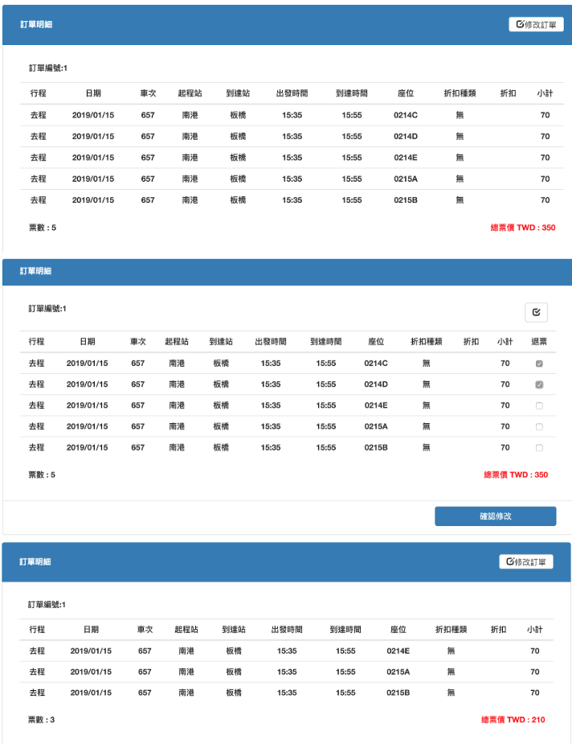

# HSR booking system

#### Environment

* MySQL 5.7
* JDK  1.8.0
* Ecplise EE 2018
* Tomcat 8.5

#### Dependency

* json-20180130.jar
* jsoup-1.11.3.jar
* mail.jar
* mysql-connector-java-8.0.11.jar
* rapid-core-4.0.5.jar

```
All of the above jars are in "official jar/"
You should put them under Tomcat's library directory.
```
#### Usage

* Use Eclipse to open the project.
* Select the target runtime (Apache Tomcat 8.5) in project properties.
* Modify the database information in **controller/DBOperator.java** and **initializer/InitializeDBOperator.java**
* Run Setup.java to setup the database.
* Start the Tomcat server.

#### UI

* **Deposit**

  

* **Booking**

  

  

  

* **TimeTable**

  

  

* **History**

  